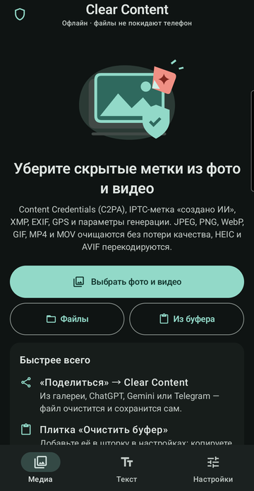
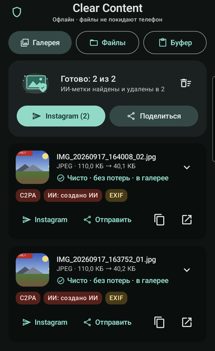
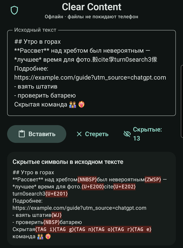
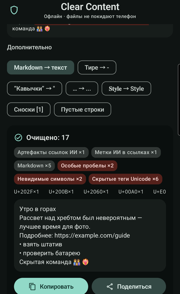
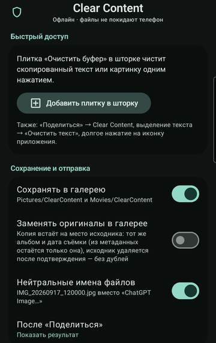

<div align="center">


# Clear Content

**Offline Android app that strips provenance metadata and hidden characters from your photos, videos and text.**

[](https://github.com/izhddm/clear-content-android/actions/workflows/ci.yml)
[](https://github.com/izhddm/clear-content-android/releases/latest)
[](LICENSE)


English · [Русский](README.ru.md)

</div>

You touch up your own photo in ChatGPT, Gemini (Nano Banana), Firefly or another editor. The editor writes Content Credentials (C2PA) and an IPTC "trained algorithmic media" tag into the file, and Instagram then shows **AI info** on your post.

Clear Content removes that file metadata, plus EXIF/GPS, XMP, generation prompts and video metadata. It also removes invisible characters and chatbot artifacts from text. Everything runs on the device: the app has no `INTERNET` permission.

<p align="center">
  
  
  
  
  
</p>

## Features

- **Lossless photo cleaning** for JPEG, PNG, WebP and GIF. Only metadata segments and chunks are removed; the pixel data is copied byte for byte. Orientation and the colour profile are kept.
- **HEIC / AVIF / TIFF / BMP** are decoded and saved again, with optional resizing and format conversion (JPEG / PNG / WebP).
- **Video (MP4 / MOV)**: removes C2PA `uuid` boxes, `udta`/`meta` (Apple keys, TC260 AIGC labels, location) without re-encoding, and rewrites `stco`/`co64` offsets. Fragmented MP4 and WebM are remuxed.
- **Text**: removes zero-width and bidi characters, narrow NBSP (U+202F), Unicode tag "ASCII smuggling", variation-selector payloads, private-use chatbot citation tokens (`citeturn0search0`, `【4:0†source】`) and `utm_source=chatgpt.com`. Emoji ZWJ sequences, subdivision flags, Persian/Indic joiners and CJK variation sequences stay intact. Markdown → plain text, typography and "fancy letters" normalisation are optional.
- **Detector** for 25+ generators and tools, including OpenAI, Google Gemini/Imagen, Adobe Firefly, Midjourney, Stable Diffusion/ComfyUI, Flux, Meta AI, Grok, Kling, Doubao/Jimeng and Apple Image Playground.
- **Verified output**: every result is scanned again, and nothing is published while any marker remains.
- **Fast entry points**:
  - the Android share sheet;
  - a Quick Settings tile that cleans the clipboard;
  - the text-selection menu ("Очистить текст");
  - launcher shortcuts;
  - one-tap sending to Instagram.
- **Replace originals** (optional, Android 11+): the clean copy takes the original's album and capture date, and the original is deleted after the system confirmation, so the gallery gets no duplicates.
- Batch queue backed by a foreground service, so "Share → Back" still finishes large videos.

The app UI is in Russian; contributions of other translations are welcome.

## Install

1. Download `ClearContent-<version>.apk` from [**Releases**](https://github.com/izhddm/clear-content-android/releases/latest).
2. Open it on the phone and allow installing from that source. Play Protect may warn about an unknown app; choose *Install anyway*. On Samsung you may need to switch off *Auto Blocker* temporarily.
3. Optional: in Settings, tap *Add tile* to put the clipboard tile into Quick Settings.

**Verify the download.** Release APKs are signed with this certificate:

```
SHA-256: 09a5e0b3873a20ad1e6a25b8379381327aeac2c13bc85e76c3b22cdaaa9da346
```

```bash
apksigner verify --print-certs ClearContent-1.1.0.apk
gh attestation verify ClearContent-1.1.0.apk --repo izhddm/clear-content-android   # for CI-built releases
```

## What is removed

| Container | Removed | Kept |
|---|---|---|
| JPEG | APP1 EXIF/XMP, APP11 JUMBF (C2PA), APP13 IPTC, COM, JFIF/JFXX thumbnails, MPF extra frames, data after EOI | ICC profile, Adobe APP14 colour transform, orientation |
| PNG | `caBX`, `tEXt`/`zTXt`/`iTXt` (A1111/ComfyUI prompts, XMP), `eXIf`, `tIME`, unknown ancillary chunks, data after IEND | rendering chunks, `iCCP`, orientation |
| WebP | `EXIF`, `XMP `, `C2PA`, unknown chunks (VP8X flags and RIFF size are rewritten) | image/animation chunks, `ICCP` |
| GIF | comments, XMP and C2PA application extensions | frames, looping, ICC |
| MP4/MOV | top-level `uuid`/`meta`/`free`, `moov`/`trak` `udta` and `meta`, `©` atoms | audio/video samples (not re-encoded) |
| Text | invisible, bidi, tag, control and private-use characters, chatbot citation leftovers, AI referral parameters | everything visible |

In *replace originals* mode the capture date (`DateTimeOriginal` + `OffsetTimeOriginal`) is also written back, so the photo keeps its place in the gallery timeline.

## Limitations and responsible use

Clear Content removes **file metadata** and **hidden characters** — the same kind of data privacy tools such as ExifTool remove.

- **It does not remove pixel or wording watermarks.** Watermarks embedded in the pixels or the wording itself, such as [SynthID](https://deepmind.google/science/synthid/), used by Google and OpenAI, are not removed or altered. Files carrying one list a `c2pa.watermarked.unbound` action in their manifest.
- **It cannot guarantee a platform will not recognise AI content** by other means.
- **Follow platform rules and the law.** If you publish AI-generated or substantially AI-edited media, follow the platform's disclosure rules (for example, Meta's AI labelling policy) and applicable law. Please don't use this app to deceive people.

## Building from source

Requirements: a full JDK 17 or newer and the Android SDK with `platforms;android-37.0` and `build-tools;37.0.0`.

```bash
./gradlew :core:test                     # unit, fixture and fuzz tests (JVM)
./gradlew :app:assembleDebug             # debug APK
./gradlew :app:connectedDebugAndroidTest # full pipeline on a device or emulator
./scripts/build-release.sh               # tests + signed release APK → dist/
```

Release signing reads `keystore.properties` and falls back to the debug key when that file is missing. See [CONTRIBUTING.md](CONTRIBUTING.md#releases).

### Desktop CLI

The cleaning core is plain Kotlin and also ships as a command-line tool:

```bash
./gradlew :core:installDist
core/build/install/clear-content/bin/clear-content scan  photo.jpg video.mp4
core/build/install/clear-content/bin/clear-content clean -o out/ photo.jpg video.mp4
echo "text" | core/build/install/clear-content/bin/clear-content text --markdown
```

## Architecture

```
core/   pure Kotlin/JVM, no dependencies
  media/   format sniffing; JPEG/PNG/WebP/GIF/ISO-BMFF parsers, scanners and lossless strippers;
           AI signature analysis; streaming ByteSource for large videos
  text/    context-aware Unicode sanitizer, chatbot artifacts, Markdown stripper
  cli/     command-line tool
app/    Android (Kotlin, Jetpack Compose, Material 3)
  media/   MediaCleaner (scan → strip/re-encode/remux → verify → publish), ImageReencoder, VideoRemuxer,
           SourceReader, OutputStore (MediaStore, FileProvider), GalleryOriginals
  queue/   app-scoped CleanQueue + ProcessingService (foreground)
  system/  clipboard, sharing, incoming intents
  ui/      Compose screens, PROCESS_TEXT activity, clipboard activity, Quick Settings tile
design/ SVG sources of the icon and illustrations
```

## Testing

- **JVM tests** (`./gradlew :core:test`):
  - synthetic JPEG/PNG/WebP/GIF/MP4 cases, including offset rewriting and deep-nesting guards;
  - text cases;
  - fuzzing with corrupted media;
  - 31 reference files in [`core/src/test/resources/fixtures`](core/src/test/resources/fixtures): real C2PA-signed samples plus synthetic generator output.
- **Instrumented tests** exercise the whole Android pipeline on a device: every fixture, HEIC/AVIF re-encoding, remuxing, MediaStore and FileProvider, and replace mode.
- **Independent verification**: cleaned files were checked with ExifTool, c2pa-python/c2patool and ffprobe. The scripts are in [`fixtures/_tools`](core/src/test/resources/fixtures/_tools).

CI runs the build, unit tests, lint and emulator tests on every pull request.

## Contributing

Issues and pull requests are welcome — see [CONTRIBUTING.md](CONTRIBUTING.md). Please **never attach personal photos** to issues. Report security problems privately (see [SECURITY.md](SECURITY.md)).

## Acknowledgements

**Standards**
- [C2PA specification](https://c2pa.org/specifications/)
- [IPTC Digital Source Type vocabulary](https://cv.iptc.org/newscodes/digitalsourcetype/)
- ISO/IEC 14496-12 (ISO BMFF)
- [PNG Third Edition](https://www.w3.org/TR/png-3/)
- [WebP container](https://developers.google.com/speed/webp/docs/riff_container)
- Unicode [UTS #51](https://unicode.org/reports/tr51/) and Default_Ignorable_Code_Point

**Prior art and research** (ideas only, no code copied)
- [guillaumemeyer/watermarks-remover](https://github.com/guillaumemeyer/watermarks-remover) — default-ignorable code point list
- [wiltodelta/remove-ai-watermarks](https://github.com/wiltodelta/remove-ai-watermarks) — overview of metadata carriers
- [LeonardSEO/chatgpt-watermark-remover](https://github.com/LeonardSEO/chatgpt-watermark-remover) — hidden characters in chatbot text

**Test fixtures and verification tools**
- [contentauth/c2pa-rs](https://github.com/contentauth/c2pa-rs) (sample files, c2patool)
- [c2pa-python](https://github.com/contentauth/c2pa-python)
- [c2pa-node](https://github.com/contentauth/c2pa-node)
- [ExifTool](https://exiftool.org/) by Phil Harvey
- [FFmpeg](https://ffmpeg.org/)
- [Pillow](https://python-pillow.org/) and [pillow-heif](https://github.com/bigcat88/pillow_heif)

**Libraries**
- [Kotlin](https://kotlinlang.org/) and [kotlinx.coroutines](https://github.com/Kotlin/kotlinx.coroutines)
- [AndroidX](https://developer.android.com/jetpack/androidx): Core, Activity, Lifecycle, DataStore
- [Jetpack Compose](https://developer.android.com/compose) with Material 3 and Material Icons
- [Coil](https://github.com/coil-kt/coil)
- JUnit 4 and AndroidX Test

**Artwork**
- Icon and illustrations were created for this project with the help of OpenAI Codex (vector drawables, sources in [`design/`](design)).

Third-party notices are collected in [NOTICE](NOTICE).

## License

[Apache License 2.0](LICENSE) © 2026 Dmitriy ([@izhddm](https://github.com/izhddm))
